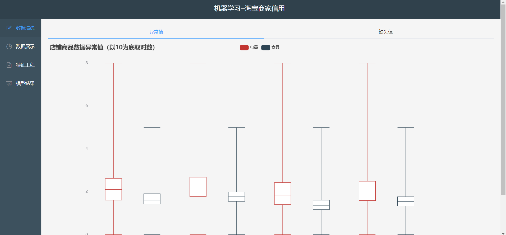

# ml_front

这是一个关于淘宝和天猫店铺数据的机器学习项目前端，采用vue框架来编写。在这个项目中，我们从淘宝和天猫爬取了部分店铺的信用评分，用户评价等信息。然后用特征提取和NLP等手段对店铺的信用进行了分析。

关于店铺数据以及NLP部分源码可以从仓库（https://github.com/root-zr/ml-hw）获取。

#### 仓库的启动方式如下：

在您打开仓库之后首先需要安装部分插件，比如echarts等，所以您需要在终端中输入以下指令：

```
npm install
```

然后输入下面的命令就能启动项目

```
npm run serve
```

#### **在浏览其中打开效果如下：**



您看到的页面中包括数据清洗的内容，主要是异常值和缺失值。通过点击左侧的导航栏可以分别看到如下的内容：

* 数据展示部分效果：


数据展示部分主要使用百度的echarts插件，用户通过点击图标中的不同位置可以动态显示对应的信息。

* 特征工程部分效果：


特征工程主要包括两部分内容（店铺信用数据，NLP），这里可以看到全部的特征信息。

* 模型结果模块效果：


在这一部分展示了我们通过对店铺聚类分析之后的结果，不同的颜色表示不同的类别。和前几个模块一样，当用户将鼠标放置在页面的不同位置，将会返回对应的结果。